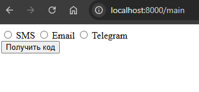
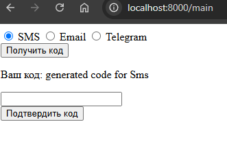
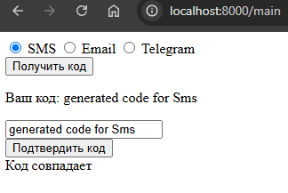
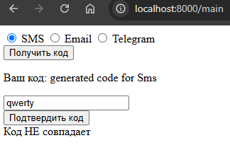

### Система настроек пользователя

## Демонстрация работы

1. Получение разметки

    
2. Выбор настройки получения кода

    
3. Подтверждение кода (успешный вариант)

    
    
    Подтверждение кода (неуспешный вариант)

    

## Ответы на вопросы

Какие вы выделили бы слои, абстракции, таблицы? Как связали бы модели?

1. Пользовательский интерфейс:

    * Формы для ввода логина и пароля
    * Форма для ввода кода подтверждения
    * Уведомления об ошибках и успехах
2. Контроллеры:
    
    * Контроллер аутентификации (логин, выдача кода, проверка кода)
    * Контроллер обработки сессий
3. Сервисы:

    * Сервис отправки кода (например, по электронной почте или SMS, или Telegram)
    * Сервис проверки кода на основе времени (например, для временных кодов)
4. Таблицы: 

    * Таблица User
    * Таблица VerificationCode
5. Модели:

    * Модель User будет иметь связь один ко многим с моделью VerificationCode
    * Один пользователь может иметь несколько кодов подтверждения (например, если он запрашивал повторное подтверждение)

В рамках данной работы я не стал разворачивать образ MySQL или PostgreSQL внутри докера, чтобы реализовать задание с рабочей базой, потому что, как я понял, достаточно было показать абстрактно, как можно оформить работу. Для сохранения кода использовал сессии, как и что делал - можно посмотреть в коммитах